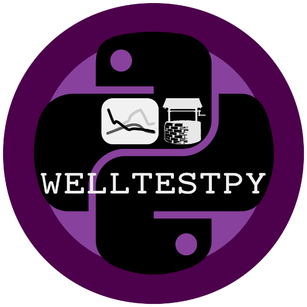

.. image:: pics/GeoStat.png
   :width: 250px
   :align: center

.. centered:: **Create your geo-statistical model with Python!**

Included Packages
=================

The following Python-Packages are part of the GeoStat Framework.

GSTools
-------

GeoStatTools is a library providing geostatistical tools like kriging,
random field generation, variogram estimation, covariance models and much more.

.. list-table::
   :widths: 33 67

   * - **Version**
     - .. image:: https://badge.fury.io/py/gstools.svg
          :target: https://badge.fury.io/py/gstools
       .. image:: https://img.shields.io/conda/vn/conda-forge/gstools.svg
          :target: https://anaconda.org/conda-forge/gstools

   * - **Installation**
     - ``pip install gstools`` *or* ``conda install gstools``

   * - **Source**
     - https://github.com/GeoStat-Framework/GSTools

   * - **Documentation**
     - https://gstools.readthedocs.io

PyKrige
-------

PyKrige provides 2D and 3D ordinary and universal kriging.

.. list-table::
   :widths: 33 67

   * - **Version**
     - .. image:: https://badge.fury.io/py/PyKrige.svg
          :target: https://badge.fury.io/py/PyKrige
       .. image:: https://img.shields.io/conda/vn/conda-forge/pykrige.svg
          :target: https://anaconda.org/conda-forge/pykrige

   * - **Installation**
     - ``pip install PyKrige`` *or* ``conda install pykrige``

   * - **Source**
     - https://github.com/GeoStat-Framework/PyKrige

   * - **Documentation**
     - https://pykrige.readthedocs.io

ogs5py
------

ogs5py is a Python-API for the OpenGeoSys 5 scientific modeling package.

.. list-table::
   :widths: 33 67

   * - **Version**
     - .. image:: https://badge.fury.io/py/ogs5py.svg
          :target: https://badge.fury.io/py/ogs5py
       .. image:: https://img.shields.io/conda/vn/conda-forge/ogs5py.svg
          :target: https://anaconda.org/conda-forge/ogs5py

   * - **Installation**
     - ``pip install ogs5py`` *or* ``conda install ogs5py``

   * - **Source**
     - https://github.com/GeoStat-Framework/ogs5py

   * - **Documentation**
     - https://ogs5py.readthedocs.io

WellTestPy
----------

WellTestPy is a python-package for handling well based field campaigns.

.. list-table::
   :widths: 33 67

   * - **Version**
     - .. image:: https://badge.fury.io/py/welltestpy.svg
          :target: https://badge.fury.io/py/welltestpy

   * - **Installation**
     - ``pip install welltestpy``

   * - **Source**
     - https://github.com/GeoStat-Framework/welltestpy

   * - **Documentation**
     - https://welltestpy.readthedocs.io

AnaFlow
-------

Anaflow provides several analytical and semi-analytical solutions for the
groundwater-flow-equation.

.. image:: pics/Anaflow.png
   :width: 150px
   :align: center

.. list-table::
   :widths: 33 67

   * - **Version**
     - .. image:: https://badge.fury.io/py/anaflow.svg
          :target: https://badge.fury.io/py/anaflow

   * - **Installation**
     - ``pip install anaflow``

   * - **Source**
     - https://github.com/GeoStat-Framework/AnaFlow

   * - **Documentation**
     - https://anaflow.readthedocs.io

pentapy
-------

pentapy is a toolbox to deal with pentadiagonal matrices in Python.

.. list-table::
   :widths: 33 67

   * - **Version**
     - .. image:: https://badge.fury.io/py/pentapy.svg
          :target: https://badge.fury.io/py/pentapy

   * - **Installation**
     - ``pip install pentapy``

   * - **Source**
     - https://github.com/GeoStat-Framework/pentapy

   * - **Documentation**
     - https://pentapy.readthedocs.io
